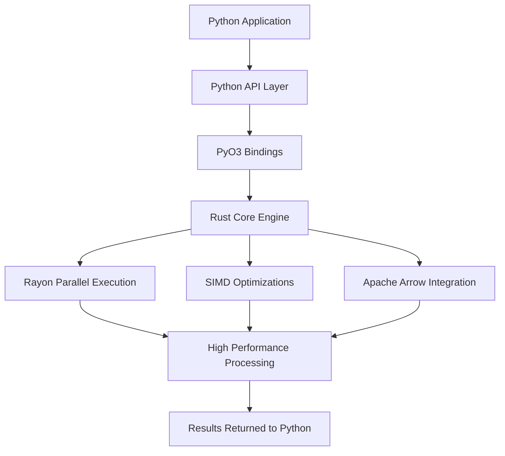

# mohu

Rust-powered arrays for Python. Fast, parallel, and built for the future.

mohu is an early-stage NumPy replacement with its core written in Rust. The goal is simple — take everything Python's scientific stack does and do it without the bottlenecks that have been accepted for decades.

No GIL. No single-threaded ops. No object overhead. Just arrays.

## why

NumPy is written in C and hasn't fundamentally changed in 20 years. It's single-threaded by default, its string arrays are an afterthought, and parallelism requires reaching for other tools. The Python data ecosystem deserves a better foundation.

Polars proved you can rewrite the data layer in Rust and win. mohu is that same bet, one layer down.
## system workflow

The diagram below shows how Mohu processes data from Python through the Rust core engine and returns optimized results.
 

### architecture overview

1. **Python API Layer** provides a familiar Python interface for users.
2. **PyO3 Bindings** bridge Python and Rust with minimal overhead.
3. **Rust Core Engine** executes computationally intensive operations.
4. **Rayon** enables automatic multi-core parallel execution.
5. **SIMD Optimizations** accelerate vectorized numerical workloads.
6. **Apache Arrow Integration** provides efficient columnar memory interoperability.
7. Processed results are returned to Python with minimal copying.
## what's coming

- N-dimensional arrays with a NumPy-compatible API
- Parallel operations by default via Rayon
- First-class string arrays — not `dtype=object`
- Built on Apache Arrow — interop with Polars, DuckDB, and the rest of the ecosystem out of the box
- Zero-copy Python integration via PyO3
- SIMD-accelerated math ops
- Memory layouts NumPy can't express

## status

Early. The foundation is being laid. If you believe the Python numerical stack deserves a rewrite, watch this repo or contribute.

## built with

- [Rust](https://rust-lang.org)
- [PyO3](https://github.com/PyO3/pyo3) — Python bindings
- [arrow-rs](https://github.com/apache/arrow-rs) — columnar memory format
- [Rayon](https://github.com/rayon-rs/rayon) — data parallelism

## license

MIT
